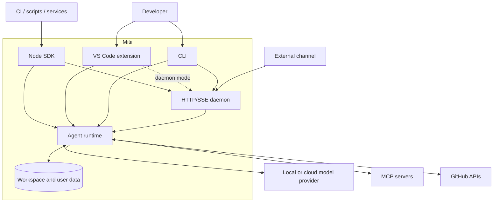
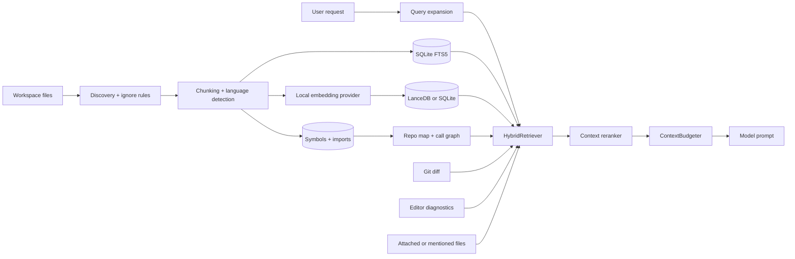
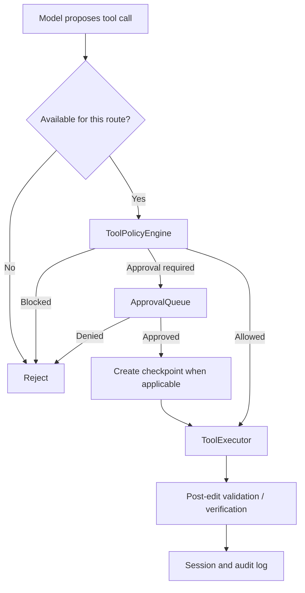
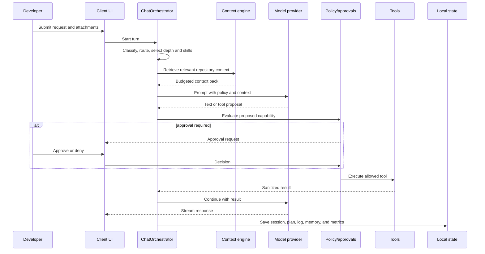

# Mitii Architecture

This document explains how Mitii turns a developer request into a context-aware, policy-controlled agent run. It is written for contributors, platform engineers, and security reviewers.

## 1. System goals

Mitii is designed around five constraints:

1. **Local ownership** — repository indexes, plans, memory, checkpoints, and logs remain under user-controlled storage.
2. **Explicit control** — writes, commands, network access, and remote operations pass through policy.
3. **Provider portability** — the runtime supports local and hosted model providers behind shared interfaces.
4. **Multiple clients** — VS Code, CLI, SDK, daemon, and channel adapters can use the same core concepts.
5. **Recoverable work** — long tasks persist state and expose progress, approvals, verification, and audit evidence.

## 2. System context



The configured provider is the main data egress boundary. MCP servers, GitHub, web fetches, channels, and telemetry webhooks are additional boundaries only when enabled and permitted.

## 3. Runtime surfaces

| Surface | Entry point | Responsibility |
|---|---|---|
| VS Code | `src/extension.ts` | Activates the extension, creates the controller, registers the webview and commands |
| Webview | `src/webview-ui/src/App.tsx` | Chat, plans, approvals, activity, history, settings, and index status |
| Editor bridge | `src/vscode/` | VS Code commands, messages, SCM integration, diffs, and workspace adapters |
| Embedded runtime | `src/core/app/ThunderController.ts` | VS Code composition root for indexing, providers, sessions, tools, safety, memory, and orchestration |
| Headless runtime | `src/core/headless/HeadlessAgentHost.ts` | Reusable non-editor composition root used by CLI, SDK, and daemon sessions |
| CLI | `src/node/cli.ts` | Headless commands, interactive sessions, daemon administration, jobs, teams, and index operations |
| SDK | `packages/sdk/src/` | Typed `query()`, client APIs, events, and daemon client imports |
| Daemon | `packages/daemon/src/server.ts` | Workspace-bound HTTP sessions, SSE events, approvals, cancellation, and index-worker endpoints |
| Channels | `packages/channels/src/` | Adapters that map external messages to Mitii sessions |
| Board | `packages/board/src/server.ts` | Minimal coordination surface for parallel agent tasks |

`ThunderController` retains its legacy class name for compatibility. User-facing settings and commands use the `mitii.*` namespace, while selected `thunder.*` identifiers remain as migration aliases.

## 4. Major components

### 4.1 Presentation and editor integration

`ThunderWebviewProvider` translates typed messages between the React webview and `ThunderController`. The controller owns extension-lifetime services and publishes partial state updates back to the UI.

Editor-only behavior belongs in `src/vscode/`. Runtime policy and reusable behavior belong under `src/core/` or the headless packages.

### 4.2 Turn orchestration

`ChatOrchestrator` coordinates each request:

1. resolve the conversation task;
2. classify intent and risk;
3. run the ordered turn pipeline;
4. gather and budget context;
5. select Ask, Plan, Agent, Review, or a narrow micro-task route;
6. stream model and tool events;
7. persist state, logs, memory, and verification results.

The ordered policy pipeline lives under `src/core/pipeline/`:

```text
classify → route → depth → skills → capabilities → loop controls
```

- **classify** identifies the task shape.
- **route** selects intent, operation class, and risk.
- **depth** chooses direct, quick, or deep handling.
- **skills** selects reusable playbooks.
- **capabilities** restricts the available built-in and MCP tools.
- **loop** detects completion or lack of progress.

Mode-specific preparation remains in `src/core/modes/{ask,plan,agent}/`. Plan artifacts, validation, persistence, and execution are owned by `src/core/plans/`.

### 4.3 Context and indexing

The indexing subsystem discovers files, applies ignore and size policy, extracts symbols and imports, and stores searchable metadata.



Primary implementation areas:

- `src/core/indexing/` — discovery, queues, SQLite, FTS, symbols, embeddings, vectors, and maintenance
- `src/core/context/` — context sources, hybrid retrieval, repo maps, reranking, and token budgeting
- `src/core/rules/` — workspace instruction discovery
- `src/core/skills/` — bundled and workspace playbooks

The first indexing pass prioritizes important paths and continues remaining work in the background. File watchers enqueue focused updates instead of rebuilding the complete index.

### 4.4 Models and providers

`LlmProviderRegistry` and the provider factory expose a shared streaming interface. Provider implementations live in `src/core/llm/`; user-manageable profiles live in `src/core/providers/`.

Supported routes include OpenAI-compatible endpoints, OpenRouter, OpenAI, Azure OpenAI, AWS Bedrock, Anthropic, Gemini, DeepSeek, Cursor-compatible APIs, Codex-compatible APIs, and Echo for deterministic UI testing.

Provider capability detection controls features such as reasoning deltas and image input. Ask, Plan, Agent, and research subagents may use separate model overrides.

### 4.5 Tools and safety

Tools are defined under `src/core/tools/` and executed through the safety layer:



The effective policy combines:

- autonomy preset;
- approval mode;
- workspace trust;
- tool and command risk;
- route capability restrictions;
- network policy;
- enterprise settings.

MCP tools are registered by `McpManager`, but per-turn availability is still decided by the capability and policy layers. An MCP connection does not bypass Mitii approvals.

### 4.6 Plans, subagents, and long-running work

Plan mode creates validated, persisted artifacts. Agent mode can execute an approved saved plan through `PlanExecutor`, updating step state as work proceeds.

Typed subagents include research, implementer, reviewer, and verifier roles. Workspace-specific definitions can be placed under `.mitii/agents/`. Implementer delegation can require an explicit file or directory scope.

The CLI also supports durable jobs, worktrees, teams, and bounded parallel execution. These features remain opt-in because they can create files, processes, branches, or remote side effects.

## 5. End-to-end turn lifecycle



The loop may suspend while waiting for approval and resume with the original task and tool state. Cancellation is propagated through an abort controller in embedded runs and a session cancellation endpoint in daemon runs.

## 6. Storage and data ownership

Workspace-owned state is stored under `.mitii/`:

| Path | Purpose |
|---|---|
| `.mitii/mitii.sqlite` | Full-text index, symbols, sessions, observations, and plans |
| `.mitii/lance/` | LanceDB vector index when selected |
| `.mitii/logs/` | Structured JSONL session logs |
| `.mitii/checkpoints/` | File-copy or shadow-state checkpoints |
| `.mitii/tasks/` | Human-readable persisted task plans |
| `.mitii/jobs/` | Durable asynchronous job queue |
| `.mitii/skills/` | Workspace playbooks |
| `.mitii/agents/` | Workspace subagent definitions |
| `.mitii/mcp.json` | Workspace MCP configuration |

User-scoped state can also live under `~/.mitii/`, including provider credentials for headless use, teams, and optional auto-memory. VS Code provider secrets use SecretStorage.

Generated workspace state should not be committed unless a file is intentionally shared, such as project rules, selected skills, or MCP templates without secrets.

## 7. Daemon protocol

`mitii serve` starts a workspace-bound Node HTTP server. By default it binds to `127.0.0.1:4310`.

Core endpoint groups:

- `GET /health` and `GET /capabilities`
- session create, list, inspect, and close
- prompt submission and cancellation
- replayable Server-Sent Events
- approval responses
- index status, enqueue, delete, and repair

The daemon rejects a non-loopback bind unless explicitly permitted and requires a token for non-loopback operation. Session creation is validated against the daemon workspace root. SDK consumers import `DaemonClient` or `DaemonSessionClient` from `@mitii/sdk/daemon`.

## 8. Enterprise and security boundaries

Mitii is local-first, not offline-only. Data movement depends on enabled integrations.

| Boundary | Default behavior | Control |
|---|---|---|
| Model provider | Selected context is sent to the configured provider | `mitii.provider.*`, local-provider policy |
| MCP | Enabled servers may receive tool inputs | MCP toggles, route capabilities, approvals |
| GitHub | Issue reads and remote writes are separate capabilities | GitHub settings and remote-write approval |
| Channels | Connectors are explicitly started | enterprise channel policy |
| Telemetry webhook | Disabled until a URL is configured | telemetry URL, secret, timeout |
| Audit export | Written locally and redacted | strip-content and signing settings |

Audit packs contain sanitized session evidence, tool and approval records, a manifest, redaction report, and integrity hashes. An HMAC signing key can provide authenticity in addition to hash-based integrity.

See [docs/enterprise/SECURITY.md](docs/enterprise/SECURITY.md) and [docs/enterprise/README.md](docs/enterprise/README.md) for reviewer-facing controls.

## 9. Example: safe repository change

Request:

```text
Add request-id logging to the API and verify the middleware tests.
```

Execution:

1. The pipeline classifies the request as an implementation task and enables a scoped Agent capability set.
2. Hybrid retrieval combines API entry points, middleware symbols, related tests, diagnostics, and current Git changes.
3. The model proposes reads first, then a patch.
4. `ToolPolicyEngine` evaluates the patch under the active approval mode.
5. If required, the UI shows the affected path and waits for approval.
6. `CheckpointService` records a recoverable state before the write.
7. The patch is applied and the changed file is re-indexed.
8. Verification discovers or uses configured lint and test commands.
9. The final response includes changed files and verification results.
10. Session logs and optional memory capture the decision without storing provider secrets.

This flow is the same conceptually in VS Code, the headless SDK, and daemon sessions; only the client transport and approval presentation differ.

## 10. Repository design rules

When extending Mitii:

1. Add new intent policy to `src/core/pipeline/`, not scattered prompt conditionals.
2. Keep mode preparation thin and place reusable procedures in skills.
3. Add new tools to the runtime registry and define their safety behavior.
4. Keep VS Code APIs in adapter or composition layers where practical.
5. Treat all external systems as explicit data and side-effect boundaries.
6. Persist only the state needed for recovery, audit, or useful memory.
7. Preserve typed events across CLI, SDK, daemon, and UI surfaces.
8. Add verification for changes to routing, policy, persistence, or protocol contracts.

## 11. Build and verification

```bash
pnpm run compile
pnpm run lint
pnpm test
pnpm run smoke
```

Use `pnpm run rebuild:native` for the VS Code/Electron runtime and `pnpm run rebuild:node` for local tests when native SQLite or vector dependencies are involved.

Architecture-sensitive areas have focused test suites under `test/`, including daemon, parallel-agent, safety, retrieval, persistence, and smoke coverage. Benchmark and evaluation tooling lives in `tools/benchmark/` and is excluded from the extension runtime.
