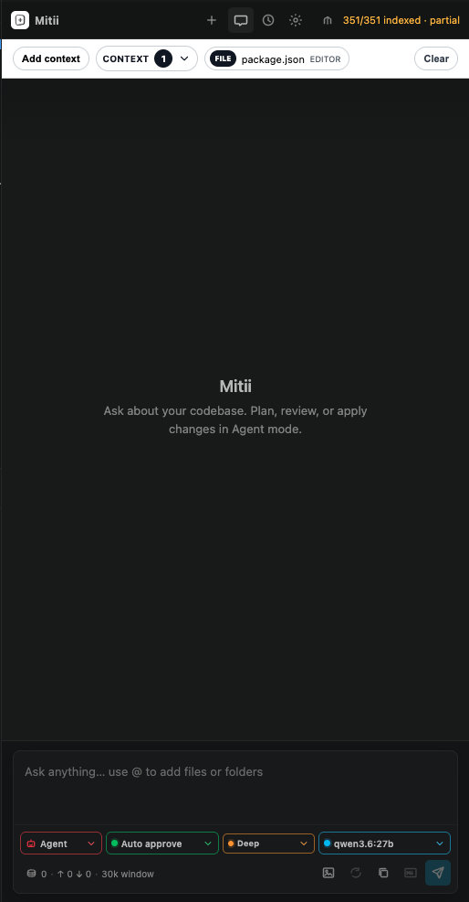
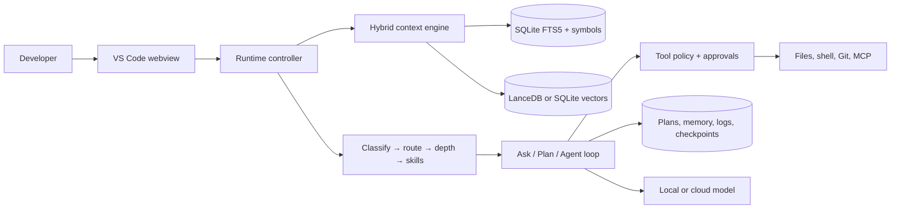

# Mitii AI Agent

<p align="center">
  
</p>

<p align="center">
  <strong>A local-first AI coding agent for VS Code with repository-aware context, controlled execution, and flexible model providers.</strong>
</p>

<p align="center">
  <a href="LICENSE"></a>
  <a href="https://code.visualstudio.com/"></a>
  <a href="https://nodejs.org/"></a>
  
  <a href="https://docs.mitii.dev"></a>
</p>

<p align="center">
  <code>AI coding agent</code> · <code>VS Code</code> · <code>local-first</code> · <code>MCP</code> · <code>Ollama</code> · <code>TypeScript</code>
</p>

Mitii understands a repository before it changes it. It combines local indexing, Ask/Plan/Agent workflows, approval-aware tools, checkpoints, memory, and audit logs in one VS Code experience. Use a local model for privacy or connect a supported cloud provider when more capability is required.

<p align="center">
  
</p>

## What Mitii provides

- **Repository-aware context** — SQLite FTS5, symbols, vectors, repo maps, diagnostics, Git state, and explicitly attached files.
- **Clear operating modes** — Ask for read-only analysis, Plan complex work, Agent applies changes, and Review inspects results.
- **Controlled execution** — configurable approvals, dangerous-command blocking, workspace trust checks, and pre-write checkpoints.
- **Model flexibility** — Ollama, LM Studio, OpenAI-compatible APIs, OpenRouter, OpenAI, Azure OpenAI, Bedrock, Anthropic, Gemini, DeepSeek, and test providers.
- **Extensible workflows** — built-in tools, MCP servers, project rules, reusable skills, typed subagents, and GitHub issue context.
- **Enterprise evidence** — local session logs, redacted audit packs, provider boundaries, managed settings, and optional SIEM webhooks.

## How it works



The extension can run the engine in-process or connect to the HTTP/SSE daemon. The CLI and `@mitii/sdk` use the same headless event model. See [ARCHITECTURE.md](ARCHITECTURE.md) for component boundaries, request flows, storage, security, and an end-to-end example.

## Quick start

### Requirements

- VS Code 1.85 or newer
- Node.js 20 or newer
- pnpm 10.13 or newer for source development

### Install from source

```bash
git clone https://github.com/Mitii-dev/Mitii.git
cd Mitii
pnpm run setup
```

Press **F5** in VS Code to open an Extension Development Host. Open a project, select the Mitii icon, wait for indexing to complete, and choose a provider in **Settings**.

For Cursor development on macOS:

```bash
pnpm run setup:cursor
```

### Connect a local model

Run an OpenAI-compatible endpoint such as Ollama, then configure:

```json
{
  "mitii.provider.type": "openai-compatible",
  "mitii.provider.baseUrl": "http://localhost:11434/v1",
  "mitii.provider.model": "qwen3-coder:30b",
  "mitii.safety.autonomyPreset": "guided",
  "mitii.safety.approvalMode": "review_all"
}
```

API keys for hosted providers are stored in VS Code SecretStorage rather than workspace settings.

## Example workflow

Ask Mitii:

```text
Plan a safe migration of the user cache to Redis. Identify affected files,
tests, rollback steps, and configuration changes. Do not edit files yet.
```

Review the generated plan, switch to Agent mode, and send:

```text
Implement the approved plan and run the relevant tests.
```

Mitii retrieves relevant context, selects the required capabilities, requests approval for protected actions, checkpoints affected files, applies scoped edits, and runs configured or discovered verification commands.

## CLI and SDK

Start the shared daemon:

```bash
mitii serve --cwd /path/to/project
curl http://127.0.0.1:4310/health
```

Install and import the Node SDK:

```bash
npm install @mitii/sdk
```

```ts
import { query } from '@mitii/sdk';

for await (const event of query({
  cwd: process.cwd(),
  prompt: 'Summarize the authentication flow',
  mode: 'ask',
  provider: 'openai-compatible',
  baseUrl: 'http://localhost:11434/v1',
  model: 'qwen3-coder:30b',
  allowNetwork: false,
})) {
  if (event.type === 'assistant_delta') process.stdout.write(event.content);
}
```

Use `DaemonClient` from `@mitii/sdk/daemon` for persistent sessions, replayable SSE events, approvals, and cancellation. More examples are in [packages/sdk/README.md](packages/sdk/README.md) and [packages/cli/README.md](packages/cli/README.md).

## Enterprise controls

Mitii keeps indexes, plans, memory, logs, and checkpoints local by default. Only context sent to the configured model provider crosses that provider boundary.

Key controls include:

- local-provider enforcement with `mitii.enterprise.localProvidersOnly`
- approval presets and workspace trust enforcement
- redacted, hash-verifiable audit pack exports
- optional removal of file contents from audit exports
- optional signed SIEM/webhook delivery
- policy switches for channels, remote writes, and parallel sessions

Security, compliance, procurement, and deployment guidance is available in [docs/enterprise](docs/enterprise/README.md).

## Repository layout

```text
mitii-ai-agent/
├── src/
│   ├── extension.ts          # VS Code entry point
│   ├── core/                 # runtime, context, safety, tools, providers
│   ├── vscode/               # editor adapters and webview bridge
│   ├── webview-ui/           # React sidebar
│   └── node/                 # CLI entry point and VS Code shim
├── packages/
│   ├── sdk/                  # @mitii/sdk
│   ├── daemon/               # HTTP/SSE runtime
│   ├── cli/                  # platform launcher
│   ├── channels/             # external channel adapters
│   └── board/                # parallel-agent task board
├── tools/benchmark/          # benchmark and evaluation harness
├── docs/                     # user, developer, and enterprise guides
├── test/                     # Vitest suite
└── scripts/                  # build, release, and audit automation
```

## Development

```bash
pnpm run watch              # extension and webview watch builds
pnpm run lint               # TypeScript validation
pnpm test                   # full Vitest suite
pnpm run smoke              # smoke tests
pnpm run package            # build the VSIX
pnpm run package:preflight  # release checks, tests, and package
```

Native modules target different runtimes:

```bash
pnpm run rebuild:native     # VS Code/Electron
pnpm run rebuild:node       # local Node.js tests
```

See [CONTRIBUTING.md](CONTRIBUTING.md) for coding conventions and pull request guidance.

## Documentation

- [Architecture](ARCHITECTURE.md)
- [User and developer guides](docs/)
- [Enterprise pack](docs/enterprise/README.md)
- [Benchmark harness](tools/benchmark/README.md)
- [Website](https://mitii.dev)
- [Hosted documentation](https://docs.mitii.dev)

## Contributing and support

Contributions are welcome. Keep changes focused and run `pnpm run lint` and `pnpm test` before opening a pull request.

- Issues: [github.com/Mitii-dev/Mitii/issues](https://github.com/Mitii-dev/Mitii/issues)
- Author: [@codewithshinde](https://github.com/codewithshinde)
- Email: [codewithshinde@gmail.com](mailto:codewithshinde@gmail.com)

## License

Mitii AI Agent is licensed under [AGPL-3.0-or-later](LICENSE). Contact the maintainer for commercial licensing outside the AGPL terms.
