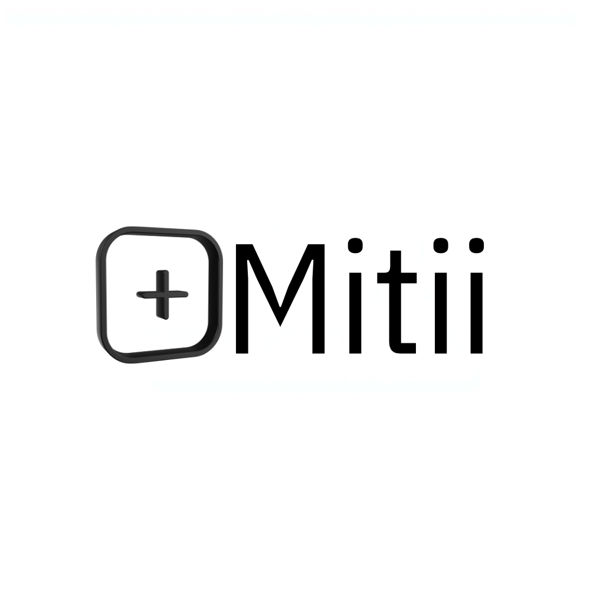
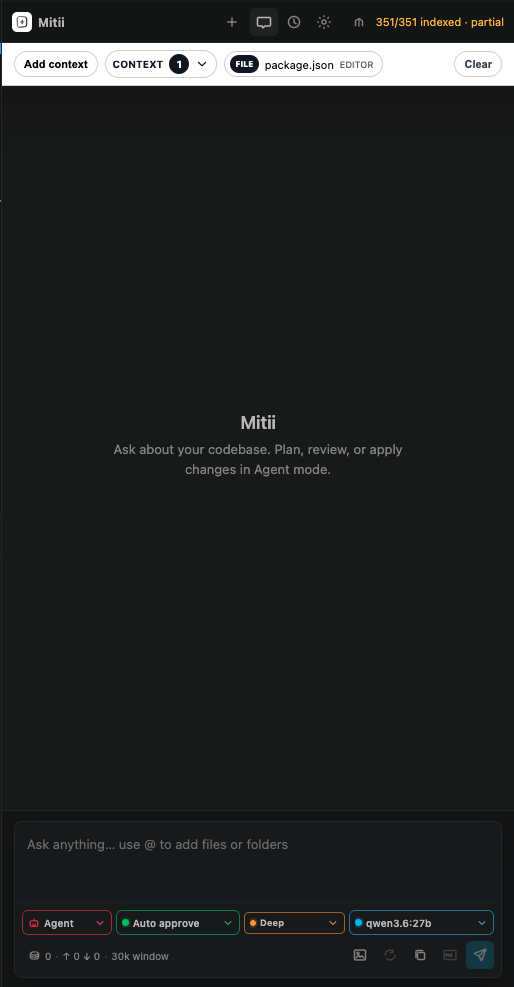
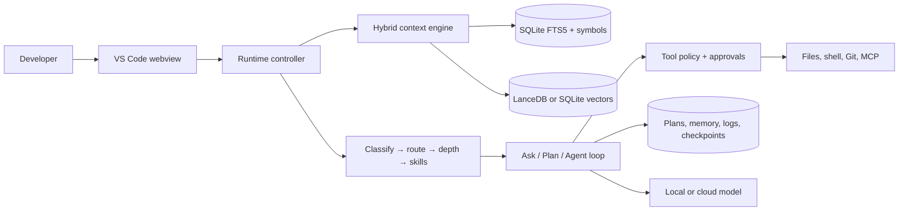

# Mitii AI Agent

<p align="center">
  
</p>

<p align="center">
  <strong>A local-first AI coding agent for VS Code with repository-aware context, controlled execution, and flexible model providers.</strong>
</p>

<p align="center">
  <a href="LICENSE"></a>
  <a href="https://code.visualstudio.com/"></a>
  <a href="https://nodejs.org/"></a>
  
  <a href="https://docs.mitii.dev"></a>
</p>

<p align="center">
  <code>AI coding agent</code> · <code>VS Code</code> · <code>local-first</code> · <code>MCP</code> · <code>Ollama</code> · <code>TypeScript</code>
</p>

Mitii understands a repository before it changes it. It combines local indexing, Ask/Plan/Agent workflows, optional FIM autocomplete, approval-aware tools, checkpoints, memory, and session logs in one VS Code experience. Use a local OpenAI-compatible model for privacy, or any OpenAI-compatible cloud endpoint when more capability is required.

<p align="center">
  
</p>

## What Mitii provides

- **Repository-aware context** — SQLite FTS5, symbols, vectors, repo maps, diagnostics, Git state, and explicitly attached files.
- **Clear operating modes** — Ask for read-only analysis, Plan complex work, Agent applies changes, and Review inspects results.
- **Evidence-assisted planning** — Plan mode can follow in-scope preflight diagnostics, discover first when evidence is thin, draft from the ask for scoped feature work, or ask clarifying questions when the request is too unclear.
- **Controlled execution** — configurable approvals, dangerous-command blocking, workspace trust checks, and pre-write checkpoints.
- **FIM autocomplete** — optional VS Code inline suggestions from a generic OpenAI-compatible `prompt` + `suffix` endpoint.
- **Model flexibility** — `echo` (local stub), native **Anthropic (Claude)** and **Gemini** adapters, plus **OpenAI-compatible** endpoints (Ollama, LM Studio, OpenRouter, OpenAI, Azure OpenAI, DeepSeek, and any `/v1` API).
- **Extensible workflows** — built-in tools, MCP servers (VS Code), project rules, and reusable skills.
- **Local evidence** — session logs and a basic audit-pack export from the VS Code host (settings redacted). Org SSO/RBAC, SIEM webhooks, and managed enterprise policy packs are not implemented yet.

## How it works


```mermaid
flowchart LR
  User[Developer] --> UI[VS Code webview]
  UI --> Controller[Runtime controller]
  Controller --> Context[Hybrid context engine]
  Context --> Index[(SQLite FTS5 + symbols)]
  Context --> Vectors[(LanceDB or SQLite vectors)]
  Controller --> Pipeline[Classify → route → depth → skills]
  Pipeline --> Loop[Ask / Plan / Agent loop]
  Loop --> Policy[Tool policy + approvals]
  Policy --> Tools[Files, shell, Git, MCP]
  Loop --> State[(Plans, memory, logs, checkpoints)]
  Loop --> Provider[Local or cloud model]
```

The extension and CLI talk to the agent through `@mitii/sdk` → `@mitii/v8`. See [packages/v8/ARCHITECTURE.md](packages/v8/ARCHITECTURE.md) for component boundaries, request flows, storage, security, and an end-to-end example.

## Quick start

### Requirements

- VS Code 1.85 or newer
- Node.js 20 or newer
- pnpm 10.13 or newer for source development

### Install from source

```bash
git clone https://github.com/Mitii-dev/Mitii.git
cd Mitii
pnpm run setup
```

Press **F5** in VS Code to open an Extension Development Host. Open a project, select the Mitii icon, wait for indexing to complete, and choose a provider in **Settings**.

For Cursor development on macOS:

```bash
pnpm run setup:cursor
```

### Connect a local model

Run an OpenAI-compatible endpoint such as Ollama, then configure:

```json
{
  "mitii.provider.type": "openai-compatible",
  "mitii.provider.baseUrl": "http://localhost:11434/v1",
  "mitii.provider.model": "qwen3-coder:30b",
  "mitii.safety.autonomyPreset": "guided",
  "mitii.safety.approvalMode": "review_all"
}
```

API keys for hosted providers are stored in VS Code SecretStorage rather than workspace settings.

### Enable FIM autocomplete

Autocomplete is disabled by default and separate from the Ask/Plan/Agent model path. Leave `baseUrl` and `model` empty to inherit the provider settings, or point them at a faster FIM-specific endpoint.

```json
{
  "mitii.autocomplete.enabled": true,
  "mitii.autocomplete.baseUrl": "http://localhost:11434/v1",
  "mitii.autocomplete.model": "your-fim-model",
  "mitii.autocomplete.endpointPath": "completions"
}
```

## Example workflow

Ask Mitii:

```text
Plan a safe migration of the user cache to Redis. Identify affected files,
tests, rollback steps, and configuration changes. Do not edit files yet.
```

Review the generated plan, switch to Agent mode, and send:

```text
Implement the approved plan and run the relevant tests.
```

Mitii retrieves relevant context, selects the required capabilities, requests approval for protected actions, checkpoints affected files, applies scoped edits, and runs configured or discovered verification commands.

For repair requests with matching preflight diagnostics, Mitii can skip redundant discovery and start from concrete Change steps tied to the failing files. Optional lightweight model enrichment can improve plan wording, but deterministic policy still owns gates, approvals, grants, and verification requirements.

## Evidence-led execution

Agent runs now carry a structured evidence artifact in addition to plan and task state. The goal is to make every major action accountable without making the live task list the source of truth.

- **Discovery report** records the target, files/searches/commands inspected, bounded discovery capacity, and why discovery stopped.
- **Issue inventory** tracks findings from diagnostics/build/verification as issues rather than just counting files.
- **Plan evidence** records how many plan steps are linked to concrete targets, reviewed context, or verification.
- **Execution ledger** records tool actions, edits, verification commands, and stop decisions with safe summaries and paths.
- **Verification delta** records before/after error counts, remaining issues, checks, and the stop reason when verification is available.

The plan remains the execution contract. Task lists are a derived progress view, useful for UI, but subordinate to plan evidence and verification. Once requested verification passes after edits, the agent should stop and summarize instead of continuing because the model produced transitional narration.

## CLI and SDK

### CLI

```bash
pnpm run build:cli
node apps/cli/bin/mitii.js --help
node apps/cli/bin/mitii.js setup --provider ollama --yes
node apps/cli/bin/mitii.js session
node apps/cli/bin/mitii.js ask "Summarize the authentication flow" --echo
node apps/cli/bin/mitii.js index --cwd /path/to/project
node apps/cli/bin/mitii.js status --json
```

New users: `mitii setup` writes non-secret provider config, then set an API key in the environment and run `mitii session` (dotted MITII banner + REPL). See [apps/cli/README.md](apps/cli/README.md) for `setup`, `ask`, `session`, `index`, `status`, and `export-session`. Daemon / `mitii serve` is deferred.

### SDK

`@mitii/v8`, `@mitii/sdk`, `@mitii/host`, and `@mitii/cli` publish to npm on `v*` release tags (see [docs/RELEASE.md](docs/RELEASE.md)). For local development, consume them from this monorepo workspace.

```ts
import { createMitiiClient, EchoLlmPort } from '@mitii/sdk';

const client = createMitiiClient({
  understandingLlm: /* host LlmPort */,
  runLlm: new EchoLlmPort(),
  workspaceRoot: process.cwd(),
  defaultMode: 'ask',
});

const run = client.start({
  prompt: 'Summarize the authentication flow',
  mode: 'ask',
});

for await (const event of run.events) {
  if (event.type === 'model_delta' && event.preview) {
    process.stdout.write(event.preview);
  }
}

await run.result;
```

The live surface is `createMitiiClient` / `start` / `resume` — not a legacy `query()` helper or `DaemonClient`. More detail: [packages/sdk/README.md](packages/sdk/README.md).

## Local safety controls

Mitii keeps indexes, plans, memory, logs, and checkpoints local by default. Only context sent to the configured model provider crosses that provider boundary.

What exists today:

- approval presets and workspace trust enforcement
- SecretStorage for API keys (VS Code)
- session logs and a basic audit-pack export (redacted settings + run events)
- OpenAI-compatible local endpoints (Ollama / LM Studio) for privacy-sensitive work

Not yet product features: `mitii.enterprise.localProvidersOnly`, signed SIEM/webhook delivery, SSO/OIDC, RBAC, or a dedicated `docs/enterprise/` pack.

## Repository layout

```text
mitii-ai-agent/
├── packages/
│   ├── v8/                   # @mitii/v8 — host-neutral agent runtime
│   └── sdk/                  # @mitii/sdk — public API over V8
├── apps/
│   ├── vscode/               # VS Code extension (F5 target)
│   └── cli/                  # headless CLI
├── tests/                    # architecture + consumer suites + solid benchmark
├── docs/                     # developer and release guides (+ automation/)
└── scripts/                  # build, release, and audit automation
```

See [docs/REPO_LAYOUT.md](docs/REPO_LAYOUT.md). Canonical architecture: [packages/v8/ARCHITECTURE.md](packages/v8/ARCHITECTURE.md). Unattended CI agents (Phase 0): [docs/automation/README.md](docs/automation/README.md).

## Development

```bash
pnpm run build:all          # build all packages + Electron SQLite for F5 / indexes
pnpm run build              # packages only (v8 + sdk + cli + vscode)
pnpm run typecheck          # typecheck v8 + sdk + cli + vscode
pnpm test                   # architecture + selected Vitest suites
pnpm run package            # build the target-specific VSIX (apps/vscode)
pnpm run package:preflight  # release checks, tests, and package
```

Native modules target different runtimes. `rebuild:native` stages the Electron
binding for F5 and restores the Node ABI in `node_modules`, so tests keep working:

```bash
pnpm run rebuild:native     # Electron → dist/native, then restore Node ABI
pnpm run rebuild:node       # Node-only (tests/CLI)
pnpm run rebuild:all        # alias of rebuild:native (both targets ready)
```

Vitest scripts auto-heal ABI mismatches via `scripts/ensure-node-native.mjs`.

See [CONTRIBUTING.md](CONTRIBUTING.md) for coding conventions and pull request guidance.

## Documentation

- [Architecture](packages/v8/ARCHITECTURE.md)
- [Repository layout](docs/REPO_LAYOUT.md)
- [Release / publish units](docs/RELEASE.md)
- [User and developer guides](docs/)
- [Solid benchmark](tests/benchmark/README.md)
- [Tests layout](docs/TESTS.md)
- [Website](https://mitii.dev)
- [Hosted documentation](https://docs.mitii.dev)

## Contributing and support

Contributions are welcome. Keep changes focused and run `pnpm run typecheck` and `pnpm test` before opening a pull request.

- Issues: [github.com/Mitii-dev/Mitii/issues](https://github.com/Mitii-dev/Mitii/issues)
- Author: [@codewithshinde](https://github.com/codewithshinde)
- Email: [codewithshinde@gmail.com](mailto:codewithshinde@gmail.com)

## License

Mitii AI Agent is licensed under [AGPL-3.0-or-later](LICENSE). Contact the maintainer for commercial licensing outside the AGPL terms.
